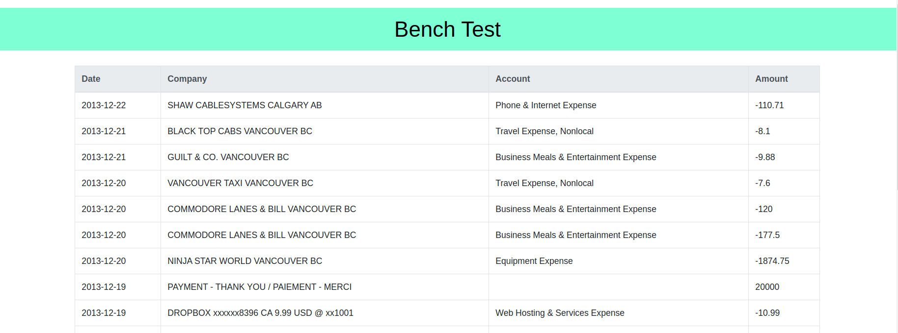

# Rest-test web application
A simple web application to consume data from a third party api and display using Express.js and templates (Handlebars). Bootstrap is used for handling the styling.  

## Sample Image



## Installation

Navigate to the root directory of the project. Open the terminal.

Use the package manager npm

```bash
npm install
```

To run the code from the root directory type the following in your terminal
```bash
npm start
```

## License
[MIT](https://choosealicense.com/licenses/mit/)

